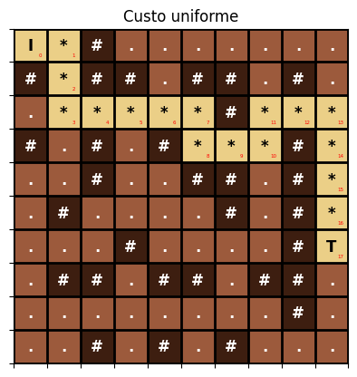
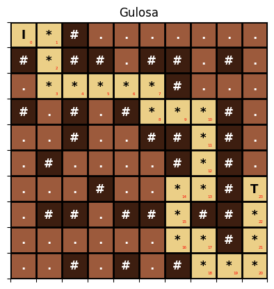

# Best-Fisrt Search

Este projeto implementa algoritmos de busca heurística para resolver o problemas de IA.

## Algoritmos Implementados
* **Custo Uniforme** Explora o nó com o menor custo de caminho.
* **Busca Gulosa:** Explora o nó com o menor valor da heurística.
* **A\*:** Combina o custo do caminho com a heurística para encontrar o caminho mais curto.

## Heurísticas

* **Distância de Manhattan:** Soma as distâncias de cada peça à sua posição correta.

## Visualização

